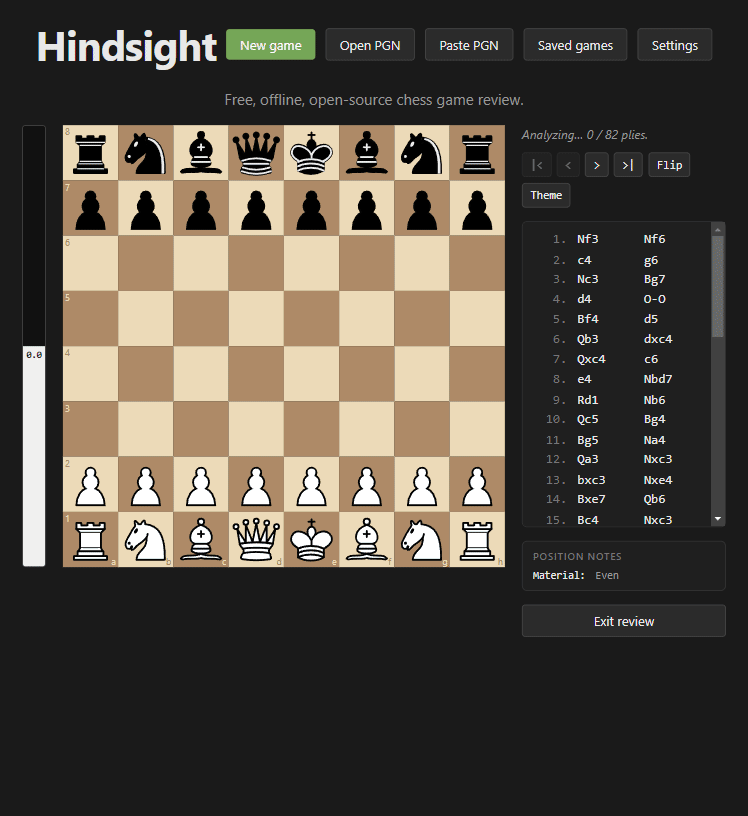
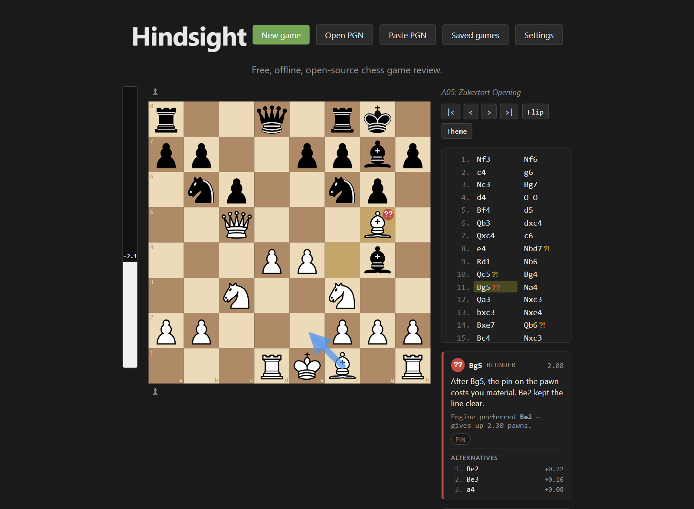
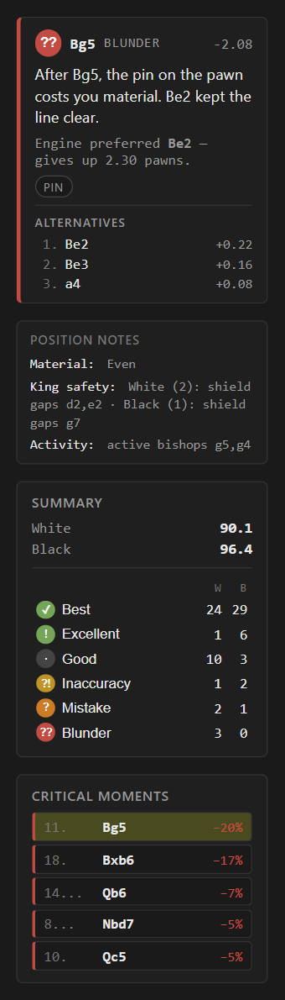
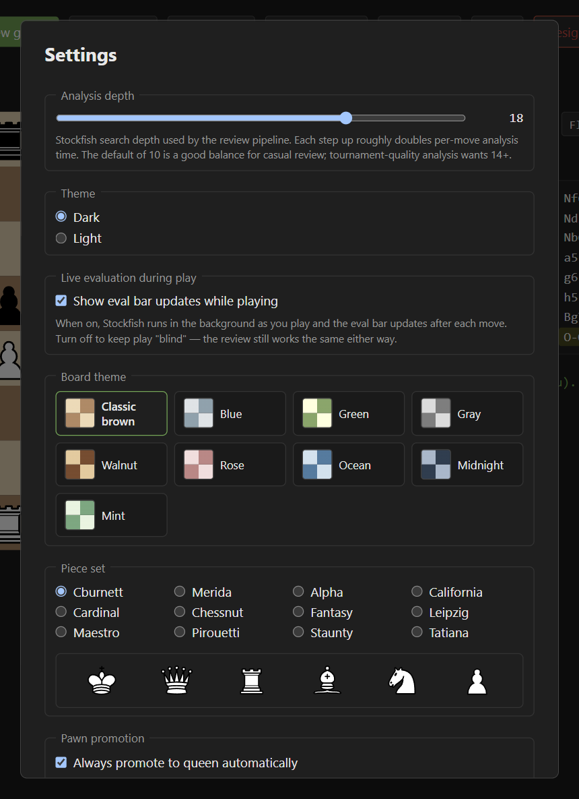
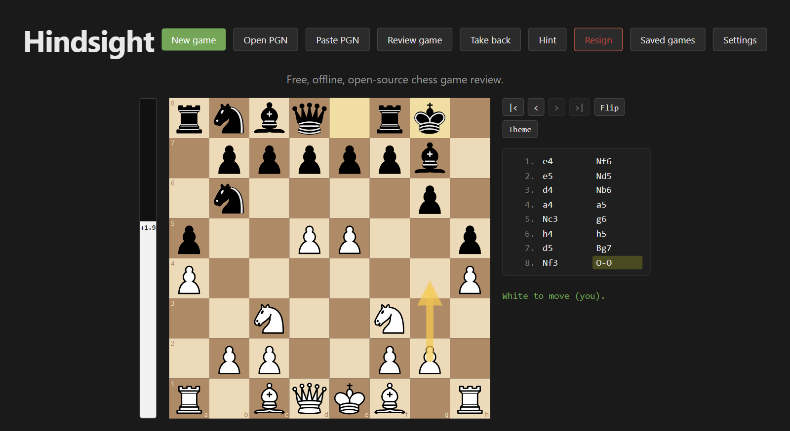
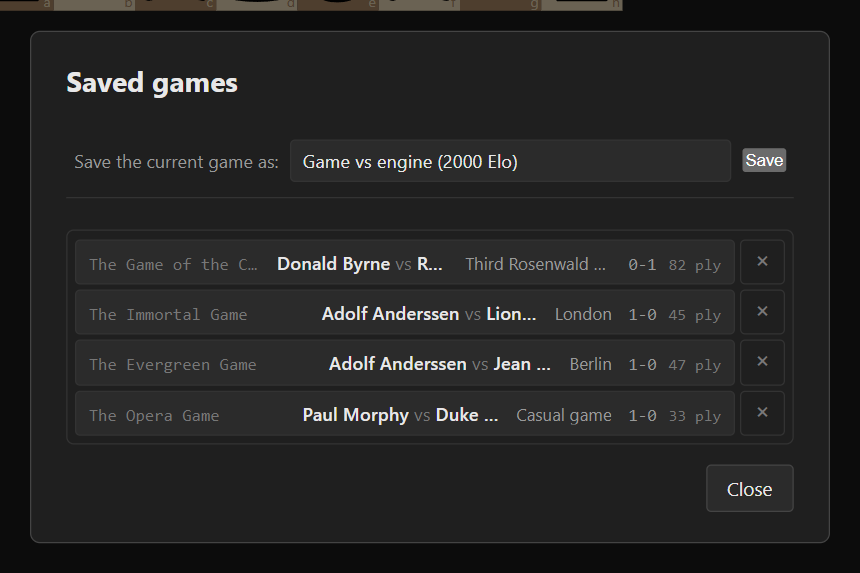

# Hindsight

[](https://github.com/ElatDev/Hindsight/actions/workflows/ci.yml)

Hindsight is a free desktop app that reviews your chess games move by move,
entirely on your own computer.

Chess.com limits Game Review on free accounts and unlocks it fully only with
a paid membership. Hindsight does the same kind of review for free: it
grades every move, points out mistakes, shows the move you should have
played and scores your accuracy. It runs offline, with no account and no
telemetry. Stockfish runs on your machine and your games stay there too.

## Screenshots



_Reviewing Byrne vs. Fischer, New York 1956 ("the Game of the Century"), in
real time at depth 16. The review then steps to 11.Bg5, graded a blunder._



The review screen: a grade badge on the moved piece, the engine's preferred
move as an arrow, an explanation, and the engine's top alternatives.

<table>
  <tr>
    <th>Critical moments and summary</th>
    <th>Settings</th>
  </tr>
  <tr>
    <td valign="top"></td>
    <td valign="top"></td>
  </tr>
  <tr>
    <th>Playing Stockfish, with a hint</th>
    <th>Saved games</th>
  </tr>
  <tr>
    <td valign="top"></td>
    <td valign="top"></td>
  </tr>
</table>

## Download

Installers are on the [Releases page](https://github.com/ElatDev/Hindsight/releases/latest).

| System                | File                                 |
| --------------------- | ------------------------------------ |
| Windows 10 and 11     | `Hindsight-0.1.0-windows-x64.exe`    |
| macOS (Apple silicon) | `Hindsight-0.1.0-mac-arm64.dmg`      |
| macOS (Intel)         | `Hindsight-0.1.0-mac-x64.dmg`        |
| Linux (x64)           | `Hindsight-0.1.0-linux-x64.AppImage` |

Stockfish is included. You don't need to install anything else, and the app
never goes online.

The installers aren't code-signed yet, so your system will warn you the
first time:

- **Windows:** SmartScreen shows "Windows protected your PC." Click
  **More info**, then **Run anyway**.
- **macOS:** open the DMG and drag Hindsight to Applications. The first time
  you open it, macOS says it can't verify the developer. Click **Done**,
  then go to **System Settings > Privacy & Security**, scroll down and click
  **Open Anyway**.
- **Linux:** make the file executable (`chmod +x Hindsight-*.AppImage`) and
  run it. AppImages need FUSE 2. On Ubuntu 24.04 that's
  `sudo apt install libfuse2t64`.

## How the analysis works

Everything below runs locally. There are no network calls and no language
models.

**The engine.** Hindsight bundles [Stockfish 17](https://stockfishchess.org/)
and runs up to four copies in parallel. Each position in the game is
analyzed once, to a fixed search depth. The default depth is 10, and
Settings lets you pick anything from 8 to 22. Higher depths take longer but
judge better. In the game above, depth 14 graded 11.Bg5 as Good; depth 16
caught it as a blunder. For careful review, use 16 to 18.

**Move grades.** For each move, Hindsight compares the evaluation before and
after it, from the point of view of the player who moved. The difference is
the centipawn loss (100 centipawns is about one pawn).

| Grade      | Rule                                          |
| ---------- | --------------------------------------------- |
| Best       | The engine's first choice, or any checkmate   |
| Excellent  | Less than 10 centipawns lost                  |
| Good       | 10 to 49 lost                                 |
| Inaccuracy | 50 to 99 lost                                 |
| Mistake    | 100 to 199 lost                               |
| Blunder    | 200 or more lost, or walking into forced mate |
| Miss       | You had a forced mate and gave it up          |

For this calculation a forced mate counts as 100,000 centipawns, so
throwing one away always grades as a big loss. A move that ends the game is
scored by the result: a win for checkmate, 0.00 for stalemate or any other
draw.

**Accuracy.** Hindsight uses the same curves as Lichess. It turns each
evaluation into a winning chance for the side to move:

```
win% = 50 + 50 × (2 / (1 + e^(−0.00368208 × centipawns)) − 1)
```

Each move's accuracy comes from how much winning chance it gave up:

```
accuracy = 103.1668 × e^(−0.04354 × (win% before − win% after)) − 3.1669
```

That value is clamped to 0–100. A player's game accuracy is the harmonic
mean of their move accuracies. A harmonic mean weighs bad moves more heavily
than a plain average does, so one blunder pulls the score down noticeably.
Each move counts as at least 0.5, so a single disaster can't drag the whole
game to zero.

**Critical moments.** These are the five moves where the winning chance
changed the most, in either direction. Click one to jump to it.

**Suggested moves and alternatives.** Every position is analyzed with three
principal variations. When your move wasn't the engine's choice, the board
shows its preferred move as an arrow. For inaccuracies, mistakes, blunders
and misses, the panel also lists the engine's top moves (up to three) with
their evaluations.

**Explanations.** After each move, Hindsight looks at the new position for
tactical patterns: hanging pieces, forks, pins, skewers, double attacks,
overloaded defenders and back-rank weaknesses. It picks an explanation from
109 hand-written templates based on the grade and the patterns it found,
then fills in the actual pieces and squares. A "Position notes" panel
summarizes material, pawn structure, king safety and piece activity.

**Openings.** The opening name comes from Lichess's
[chess-openings](https://github.com/lichess-org/chess-openings) list of
3,690 named lines. Hindsight picks the longest one that matches your moves.

**Not there yet.** The Sharp (brilliant) and Book grades are defined but not
assigned yet. Discovered attacks and "removing the defender" aren't detected
yet either.

## Other features

- Play Stockfish at 1320 to 3190 Elo, with hints, take-backs and resign.
- Import a PGN from a file or by pasting it. Files with several games open a
  game picker.
- Save games to a local database and load them later.
- Export the review as an annotated PGN, with evaluations and explanations
  as comments.
- Nine board colors, twelve piece sets, light and dark themes.
- Keyboard: arrow keys, Home and End move through a game. While playing, F
  flips the board and Backspace takes a move back.

## Build from source

You need Node.js 24 (what CI uses), npm and git.

```bash
git clone https://github.com/ElatDev/Hindsight.git
cd Hindsight
npm install
npm run dev
```

`npm install` downloads the Stockfish binary for your system into
`stockfish/bin/`. It also rebuilds `better-sqlite3` for Electron. Once
installed, the app never goes online.

Checks, the same ones CI runs on Windows, macOS and Linux:

```bash
npm run lint
npm run typecheck
npm run test:run
```

`npm run dist` builds an installer for the system you're on and puts it in
`release/`. `npm run dist:dir` builds the app folder without an installer.
The installers for other systems are built by the
[release workflow](.github/workflows/release.yml).

Two Windows notes:

- If `npm run dev` crashes with an error about `whenReady`, your shell has
  `ELECTRON_RUN_AS_NODE` set. Unset it and run again.
- `npm run dist` needs permission to create symbolic links while
  electron-builder unpacks its tools. Turn on Developer Mode
  (**Settings > System > For developers**) or build from an administrator
  terminal.

The design is described in [ARCHITECTURE.md](ARCHITECTURE.md), and the
reasons behind it in [DECISIONS.md](DECISIONS.md).
[docs/USER_GUIDE.md](docs/USER_GUIDE.md) walks through the app, and
[docs/CONTRIBUTING.md](docs/CONTRIBUTING.md) covers adding templates and
detectors.

## License

Hindsight's code is released under the [MIT license](LICENSE).

The installers include software and artwork under other licenses:

- **Stockfish** is GPLv3. Hindsight runs it as a separate program. Its
  license and a pointer to its source ship next to the binary, and each
  release attaches the matching Stockfish source.
- **The piece sets** come from Lichess and keep their authors' licenses.
  Several allow only non-commercial use.

Details for every component are in
[THIRD_PARTY_NOTICES.md](THIRD_PARTY_NOTICES.md).
